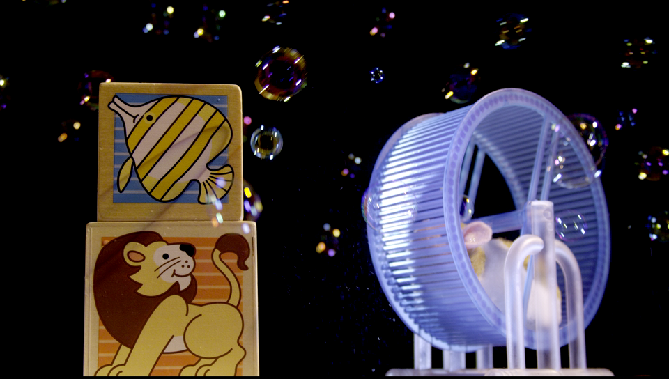
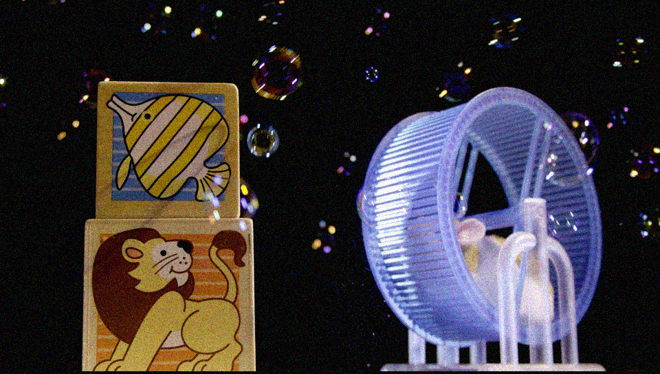
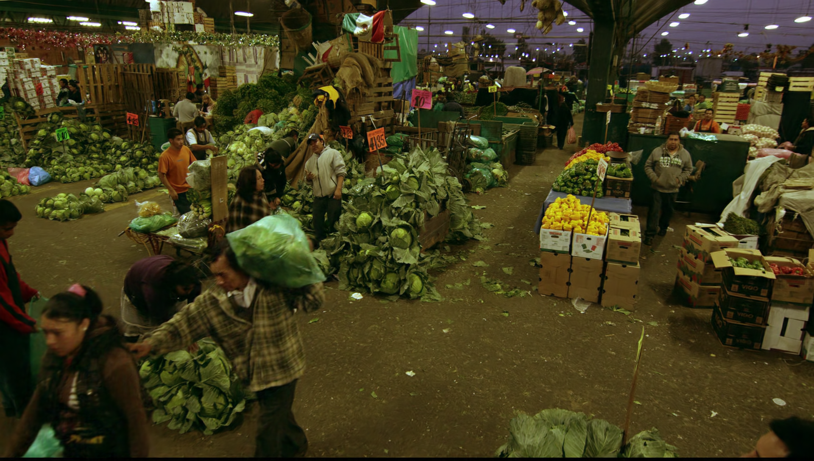
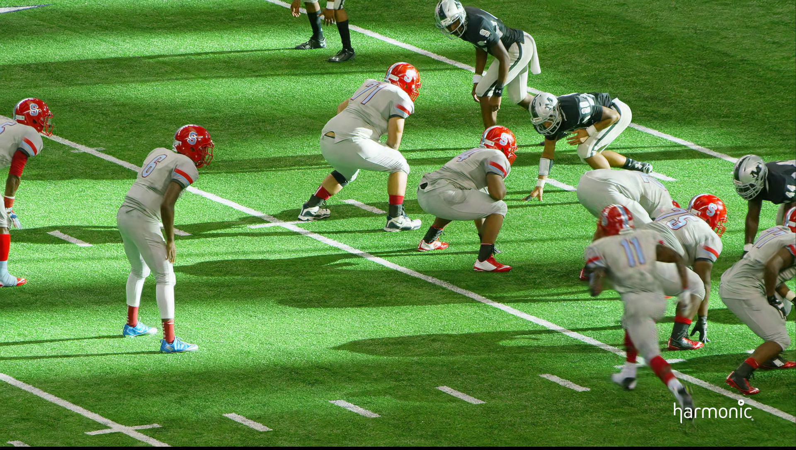
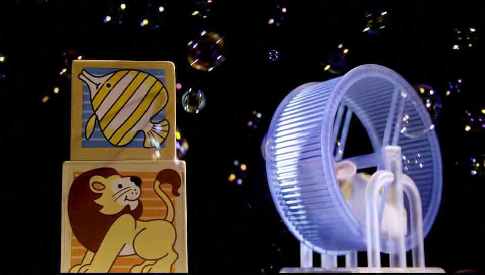
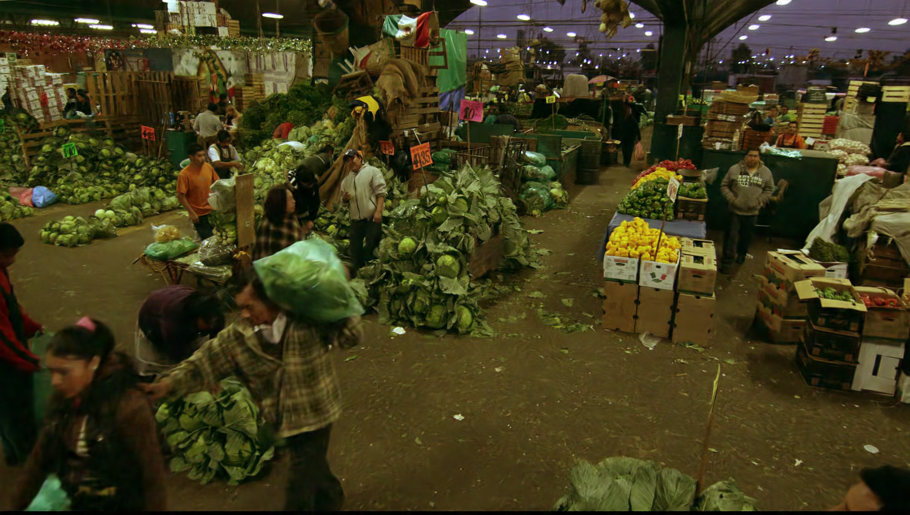

# Anonymous ICME 2024 WienerNet Suppl. Mat.
Here we present denoised image sequences as well as single frames examples.

## Compressed video examples.
For uncompressed videos, please download them here.

https://github.com/MrBled/WienerNet-ICME/assets/61942418/418abb89-f91a-4db7-959a-eb895bf31920

## WienerNet Denoised Frame Samples at sigma=20
Ground-truth\
\
Noisy 22.34 dB\
\
Denoised 30.40 dB\
\
Ground-truth\
\
Noisy 23.57 dB\
\
Denoised 35.56 dB\
\
Ground-truth\
\
Noisy 22.60 dB\
\
Denoised 34.03 dB\

## WienerNet Denoised Samples at sigma=40
\
\
\
\
\
\
\
\

